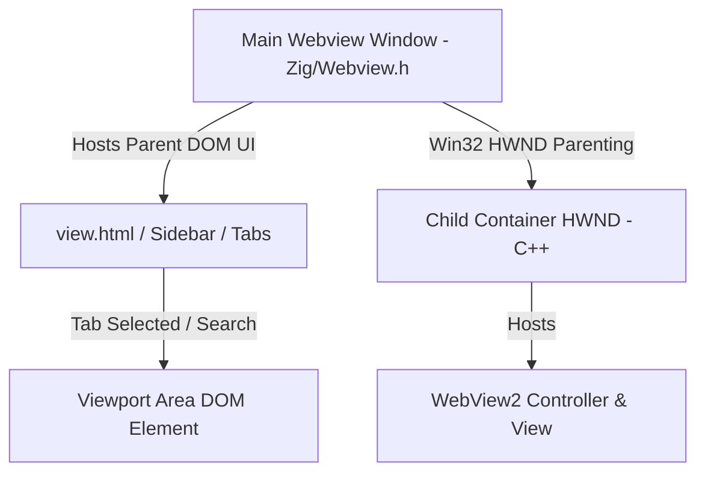

# WebView2 Integration & Architecture Design

This document details the high-performance native WebView2 integration designed for OneView. It explains how we achieve instant tab creations, coordinate layout bounds between the React DOM and Win32, and avoid memory corruption.

---

## 1. Core Architecture Overview

The window layout is structured hierarchically:



To achieve speed matching Microsoft Edge, we divide the tab hosting into:
1. **Parent Webview (main window)**: Renders the React tabs, sidebar, and general layout.
2. **Child Webviews (individual tabs)**: Spawned inside dedicated native Win32 child container windows parented to the main application window.

---

## 2. Key Technical Implementations

### A. Instant Environment Caching (`child_webview.cpp`)
Creating a WebView2 environment (`CreateCoreWebView2EnvironmentWithOptions`) takes up to several seconds because it spawns background Microsoft Edge runtime processes.

To make opening new tabs instantaneous, we pre-initialize and cache the global WebView2 environment on startup:
```cpp
// Cached globally in child_webview.cpp
static ICoreWebView2Environment* g_cached_env = nullptr;

HRESULT PreInitializeGlobalEnv(const wchar_t* subfolder, const wchar_t* profile) {
    if (g_cached_env) return S_OK;
    return CreateCoreWebView2EnvironmentWithOptions(..., 
        Callback<ICoreWebView2CreateCoreWebView2EnvironmentCompletedHandler>(
            [](HRESULT res, ICoreWebView2Environment* env) {
                g_cached_env = env; // Cached globally
                return S_OK;
            }).Get());
}
```
All subsequent tabs are initialized from this cached environment pointer, cutting down tab initialization times from ~1500ms to **under 50ms**.

### B. Safe Asynchronous Request Lifetimes (`main.zig`)
JavaScript communicates with Zig through bound IPC channels. When JavaScript creates a tab, the call is routed to Zig as a `Request` token containing a unique callback sequence ID (`seq`) matching a promise in JS.

Because creating a webview controller is asynchronous, Zig dispatches the task to the Win32 message queue and returns immediately:
```zig
// BEFORE (Bug):
// The request was passed directly. When the IPC handler returned, the library freed 
// the `seq` string memory. S.cb executed later using a dangling pointer.

// AFTER (Fixed):
ctx.req = try req.dupe(app.allocator); // Clones the sequence ID to the heap

// S.cb executes on the GUI Thread asynchronously
c.req.resolveWith("{\"success\":true}");
c.req.deinit(c.app.allocator); // Safely frees the duplicated request heap memory
```

### C. DOM-to-Win32 Bounds Syncing & Visibility (`view-tabs.js`)
Since the child webview windows exist as Win32 child windows outside of the browser's CSS tree, we track their positions dynamically using JavaScript's `ResizeObserver` and forward coordinates via IPC.

```javascript
  bindToElement(el) {
    this.hostElement = el;
    this._resizeObserver = new ResizeObserver(() => {
      this.queueSyncBounds();
    });
    this._resizeObserver.observe(el);
  }
```

To prevent race conditions where coordinates are sent before the native WebView2 controller completes initialization, we cache the coordinates and visibility on the wrapper struct in C++:
```cpp
struct ChildWebview {
    HWND hwnd;
    ICoreWebView2Controller* controller;
    int last_x, last_y, last_w, last_h;
    bool last_visible;
};
```
When `CreateCoreWebView2Controller` finishes, it applies the cached state. Furthermore, we draw off-screen (`-32000, -32000`) at `1280x720` initially to avoid WebView2 engine initialization bugs on size `0x0`.

### D. Safe Map Deletion Ordering (`main.zig`)
In Zig's `std.StringHashMap`, removing an entry relies on the key's memory buffer to compute hashes and check equality. When a tab is destroyed, we must safely order key freeing to avoid segmentation faults:

```zig
// BEFORE (Bug):
app.allocator.free(entry.key_ptr.*); // Freed the map key first!
_ = app.child_views.remove(key);     // remove() read freed memory -> Segfault!

// AFTER (Fixed):
const old_key = entry.key_ptr.*;
_ = app.child_views.remove(key);     // 1. Remove from the map first
app.allocator.free(old_key);         // 2. Free the key's allocated memory
```

### E. Active Tab Prewarming
With `TAB_PREWARM_ENABLED` enabled in `view.js`, the active tab's webview is pre-rendered and attached to the DOM on startup. This allows the very first URL navigation or search query to load instantly without a cold boot.
